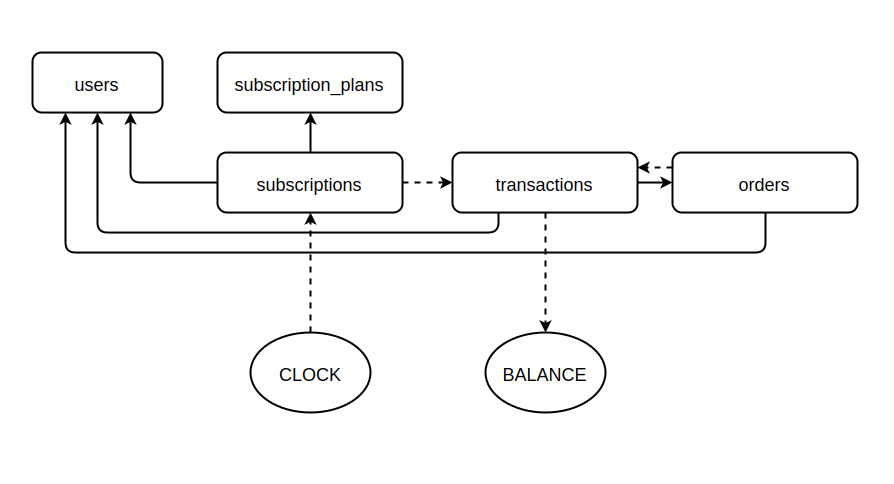
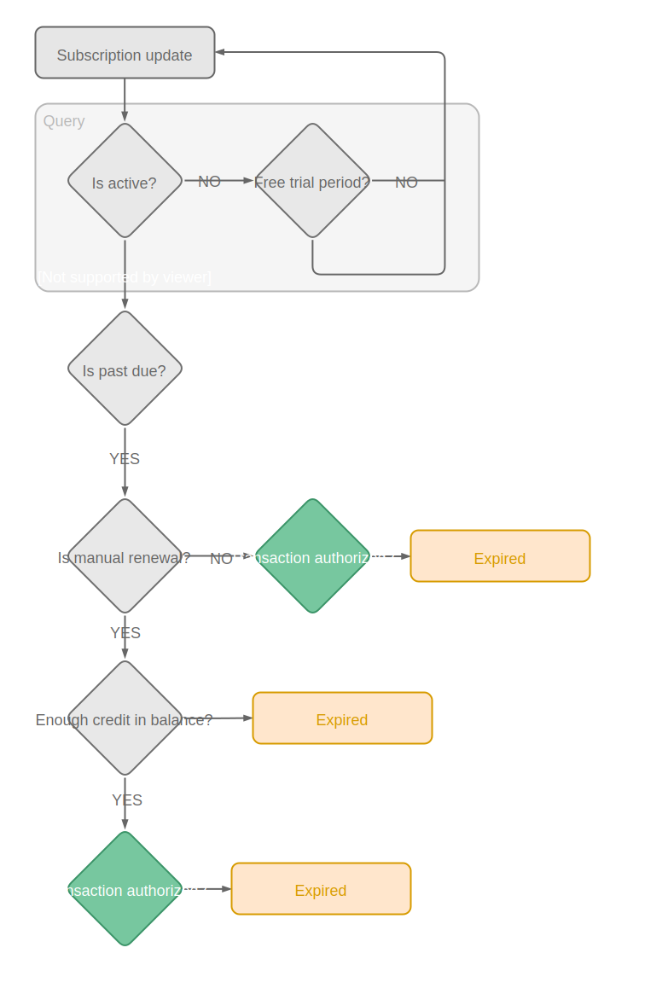

# Looper - Subscription Management System

Looper is a flexible subscription management system, designed after real-life scenarios.

## Features

* Multiple currencies
* Location detection for currency selection
* Multiple payment methods (via backends such as Braintree, Stripe, etc)
* Recurring and manual (advance-based) payments
* Up and downgrades (subscription add-ons)
* VAT support
* Coupons
* Gifts
* Invoicing
* Reporting tools (sales, customers)

## Design

Give freedom to the customer to pick the desired payment solutions. Different countries and
cultures have different expectations when it comes to subscription systems.

Looper establishes the concept of *Balance*, which is the financial status of a customer. The
balance can be affected by debit or credit transactions, which can be performed by the
customer or by the system itself (triggered by the *Clock*).

### Balance

The balance is the sum of all transactions for a certain user, and it is positively affected by
orders and negatively by the *Clock*.
These two possible scenarios can be explained as:

- The user manually adds money via an Order to their account (positive, credit)
- The renewal of a subscription affects the balance (negative, debit)

Adding credit to the balance can happen manually, so that a user can pre-pay several months of
subscription in advance, or automatically. In this case, the user will be automatically charged
for an order generated by the system. Automatic charging will happen differently depending on the
payment backend used.

### The Clock

The Clock is a command triggered regularly (every hour or every day) by a cronjob on the host
system, and runs through each Subscription, triggering further actions depending on their status
and configuration.

For example:

- Is the subscription active? (YES)
- Is is it past due? (YES)
- Is the renewal manual? (YES)
- Does the user have enough credit in the balance (NO)
- Suspend subscription and notify the user

## Models

The base functionality and collections are inherited from the Pillar Framework. For example:
Users, Tokens, Files are all valid Pillar Models.

### Transactions

A collection of every operation that affects a customer's Balance. The Transaction
lifetime follows this schema:

* Creation (pending)
* Transaction (completed or failed)

A Transaction can not be refunded, only an Order can. This will create another
Transaction in the customer's record.

### Orders

The customer places an order when he manually purchases an extra month of membership, or when he
adds some credit to his Balance.
The system can create an Order on behalf of the customer when charging a Subscription that is set
to auto-renew.

### Plans

The blueprints used to configure and create an actual Subscription. Once a Subscription is created,
it can be edited, and it only keeps a symbolic reference with its original Plan.
This allows for the user to switch from automatic to manual payments, to change backend and so on.

### Subscriptions

The actual Subscription, tied to a user. Ideally we try to assign a Subscription to a user only
once and we then keep editing it until it gets canceled. Even when canceled, a Subscription may be
restored. This might be incompatible with some backends, so we need to keep track of changes
in that regard (in particular for the backend_api_refenrece parameter).
